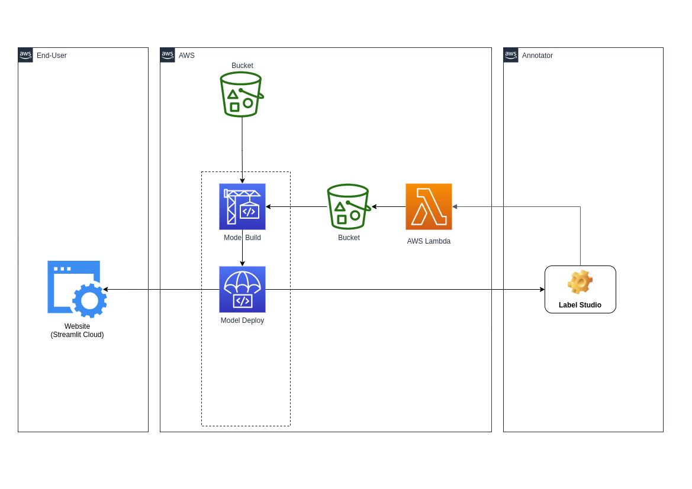
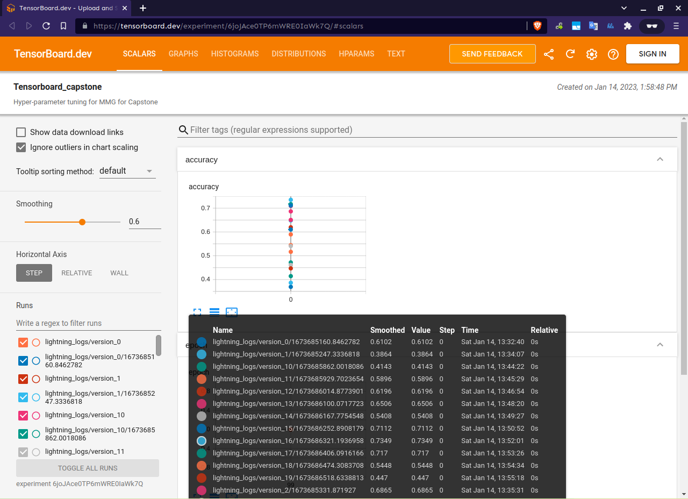
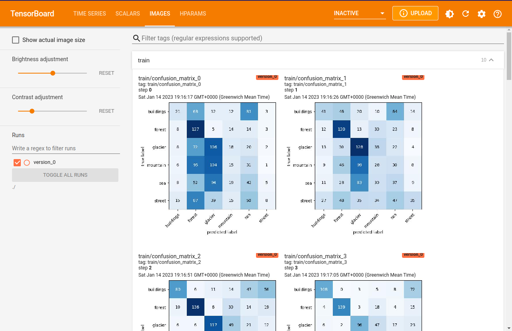
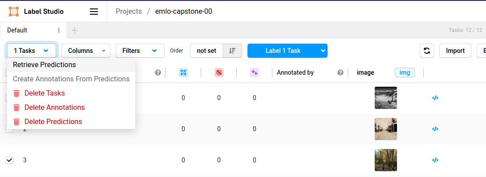

# End-to-End MLOps Pipeline using SageMaker Pipelines


The goal of the project is to run an end-to-end pipeline using SageMaker along with 
- hyper-parameter tuning
- model evaluation
- model explanation
- model testing
- serverless deployment
- data labelling with both human annotation and model prediction
- and front-end deployment.



# Video Demonstration
You can see a demo of the project [**here**](https://youtu.be/HFba6qIDNxk)

# Part 1 - Hyper-parameter Tuning (HPT)

For HPT, [Optuna](https://github.com/optuna/optuna) was used. The augmentation and dataset used is the same as that for training later.

The hyperparameters explored were:
- Model: resnet18, resnet34, resnet26
- Optimizers: Adam, SGD 
- Learning Rate: log scale in the range (1e-4, 1e-2)

The tuning video can be [seen here](https://youtu.be/qRY9sXCR3ZY).

We can see that the best model yields a validation accuracy of 73.5% and has the following hyperparameters
- Model: resnet34
- Optimizer: SGD
- Learning Rate: 0.0018308341419607547

The Tensorboard logs can be seen [online here](https://tensorboard.dev/experiment/6joJAce0TP6mWRE0IaWk7Q/)

.

These values are chosen as the default values for model training in the pipeline.

# Part 2 - SageMaker Pipeline

A pipeline is created (by modifying the skeleton project 'abalone').

## Parameters
This pipeline has the following parameters.
- Model Name
- Batch Size
- Optimizer
- Learning Rate

## Data Preprocessing
Data (in a zip file) is read from S3. 
However, it also gets additional data from another 'source'. We will see this part later!  

## Training
For model training, albumentation is used for augmentation. 

Training itself is done on SageMaker using a spot instance of 'ml.g4dn.12xlarge' which is a multi-gpu instance (with 4 Nvidia T4s). To enable DDP in SageMaker, the following argument was passed to the PyTorch estimator.

```python
distribution = { 
        "pytorchddp": {
            "enabled": True,
            "custom_mpi_options": "-verbose -x NCCL_DEBUG=VERSION"
        }
    }
```

The logs can be seen [here](https://tensorboard.dev/experiment/QljT9NtaRga2aWwmHqSRDg/)

Confusion matrix images are not logged in Tensorboard dev, but have been saved on each epoch.

.

## Evaluation
In the pipeline, the model is evaluated using the test dataset. If the accuracy is better than the one obtained via HPO, the model is registered and is subject to manual approval before deployment

The evaluation report can be seen [here](./02_pipeline/outputs/evaluation/evaluation.json).
## Data Drift
The data drift for the model is calculated using the `Alibi Detect` library. <ins>In the pipeline, this step is performed as part of the evaluate stage</ins>.

It outputs two `json` files in S3; one for the [unperturbed](./02_pipeline/outputs/data_drift/dd_unpert.json) dataset and the other for the [perturbed](./02_pipeline/outputs/data_drift/dd_pert.json) dataset.

## Explanation
The explanation for the model is calculated using the `captum` library. <ins>In the pipeline, this step is performed as part of the evaluate stage</ins>.

It outputs a set of images (one for each of the different methods) and a markdown file in S3. The markdown file can be seen [here](./02_pipeline/outputs/explanation/explanation.md).

## Robustness
The robustness for the model is (also) calculated using the `captum` library. <ins>In the pipeline, this step is performed as part of the evaluate stage</ins>.

It outputs a set of images (one for each of the different methods) and a markdown file in S3. The markdown file can be seen [here](./02_pipeline/outputs/robustness/robustness.md).

## Deployment
For our deployment, we use serverless inference in the staging part and a managed (EC2) endpoint for the production part.  The config files for the two stages can be seen here
- [staging](./02_pipeline/modeldeploy/staging-config.json)
- [prod](./02_pipeline/modeldeploy/prod-config.json)


# Part 3 - Testing
For testing, `pytest` is used. The code reads images from a directory and makes sure that the predictions match the class labels (which are the same as the filenames). It directly invokes the endpoint.

The file is located [here](./03_testing/test_intel/test_intel.py). To execute the file, you must be in the `03_testing` folder and run `pytest test_intel`


# Part 4 - Human-in-the-Loop
What if we obtain more (unlabelled) data than we initially started with?

In that case, we need to first annotate it and then upload data to a data lake (S3 in our case).

There are two ways to perform annotations
- Inference from our deployed model
- Human annotations

## Inference from deployed model
For inference, we have to use [`label-studio-ml`](https://github.com/heartexlabs/label-studio-ml-backend). The setup instructions can be found [here](https://labelstud.io/guide/ml.html#Quickstart-with-an-example-ML-backend). It calls the deployed predictor by sending the image data, and populates the predicted label along with the score. 
We can manually retrieve a prediction by selecting the task and going to Task -> Retrieve Predictions



Label Studio automatically retrieves predictions when we open it for annotation! It populates the choices with a check sign. 

## Annotation and webhooks
Once the user labels a task, it can run a webhook. This webhook has been configured to be the 'function URL' of a lambda function. This lambda function does a couple of things
- It reads the image url and the label annotated by the user.
- It copies that file to an S3 bucket (with the file under the "folder" whose name is the label)
- Recall in the pipeline section it was mentioned that it gets additional data. This is where the pipeline gets additional data from! In CloudWatch, you can see the logs that it prints class count without annotations (the original zip file) as well as with annotations. This implements our human-in-the-loop part.
- It checks if the number of annotations exceed a threshold. If not, nothing happens. If it does, then the modelbuild pipeline is triggered.

Note that this triggers the SageMaker pipeline and not the CodePipeline pipeline. This is an expected/intended behavior. It is just that only the data for training will change and not the pipeline infrastructure.

# Part 5 - Front-End and Web Deployment
For the front-end, [streamlit](https://streamlit.io/) is used. This lets you upload a file and run inference.

For global access, [Streamlit Cloud](https://streamlit.io/cloud) is used that generates a URL that can be browsed. But Streamlit Cloud cannot access libraries like PyTorch etc. To address this, a docker image was built along with a lambda function (with Function URL enabled) to access it. The docker image contains all the required libraries.

The front-end can be seen in the [video here](https://youtu.be/lOJDBymnT2o).
